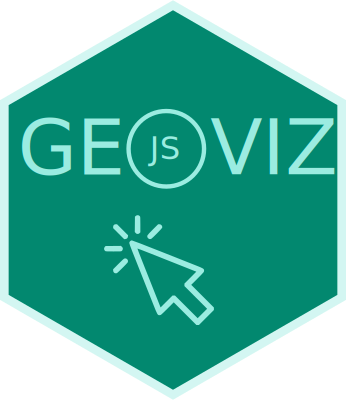
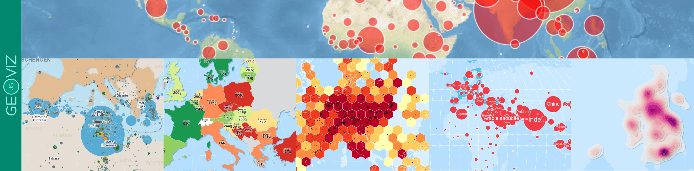

<h3 style="color: #38896F; text-align: center;">
  geoviz is an R package for thematic mapping. As its name suggests, it's an R wrapper around the <a href="https://github.com/riatelab/geoviz">geoviz JavaScript library</a>, itself based on the 
  <a href="https://d3js.org/">d3.js</a> ecosystem ported by Mike Bostock. 
  Like the original javascript library, the package can be used to create a wide range of interactive, zoomable vector maps, 
  taking advantage of d3's many features: proportional symbols, pictograms, typologies, choropleth maps, spikes, tiles, Dorling cartograms, etc. 
  It can also be used to create pretty static vectorial maps in SVG format, suitable for editorial cartography.
</h3>

 

- The `geoviz` package is an R wrapper around the geoviz JavaScript library via a htmlwidget. Its development follows the evolution of the library. The parameter names are the same. You can therefore refer to the JavaScript geoviz documentation [here](https://riatelab.github.io/geoviz/).

- `geoviz` is not intended to compete with other mapping packages in R, such as [mapsf](https://CRAN.R-project.org/package=mapsf) or [tmap](https://CRAN.R-project.org/package=tmap).

- Since it's based on d3.js, the philosophy behind this package is completely different as other R mapping packages. Map parameters use svg attributes rather than the usual R parameters. Thus, `strokeWidth` is used rather than `lwd`, `fill` rather than `col`, `stroke` rather than `border`, etc.

- `geoviz` is not designed to handle voluminous datasets. It is suitable for light, generalized basemaps. 

- `geoviz` is designed to work with geographic data in wgs84 (not projected). Geometries are then projected on the fly using the `create()` function. Unlike other R packages based on `sf`, the projections used come from the d3.js ecosystem (d3-geo, d3-geo-projection & d3-geo-polygon).

- Maps generated by `geoviz` are zoomable.  Two types of zoom are available. The classic type (pan and zoom) and the “versor” type for creating interactive globes.

- Maps created with `geoviz` are interactive. It is therefore possible to create tooltips to access information contained in geographic objects.

- Many different types of maps are available. The types can be combined with each other and are highly customizable. 
