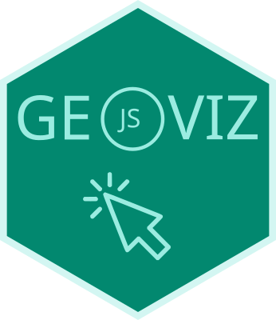

# geoviz 

geoviz is an R package for thematic mapping. As its name suggests, it's an R wrapper around the 
[geoviz JavaScript](https://github.com/riatelab/geoviz) library, itself based on the [d3.js](https://d3js.org/)
ecosystem ported by Mike Bostock. 
Like the original javascript library, the package can be used to create a wide range of interactive, zoomable vector maps, 
taking advantage of d3's many features: proportional symbols, pictograms, typologies, choropleth maps, spikes, 
tiles, Dorling cartograms, etc. 
It can also be used to create pretty static vectorial maps in SVG format, 
suitable for editorial cartography.


## Installation

<!--
You can install the released version of `geoviz` from
[CRAN](https://cran.r-project.org/package=geoviz) with:

``` r
install.packages("geoviz")
```

Alternatively, y
-->


You can install the development version of `geoviz` from [r-universe](https://riatelab.r-universe.dev/geoviz)
with:

``` r
install.packages("geoviz", repos = c("https://riatelab.r-universe.dev", "https://cloud.r-project.org"))
```

## Usage

This is a basic example which shows how to create a map with `geoviz`.


## Alternatives

`geoviz` is not intended to compete with other mapping packages in R, such as [mapsf](https://CRAN.R-project.org/package=mapsf) or [tmap](https://CRAN.R-project.org/package=tmap).
It really focuses on the html / interactive geovisualisation.  


## Community Guidelines

One can contribute to the package through [pull
requests](https://github.com/riatelab/geoviz/pulls) and report issues or
ask questions [here](https://github.com/geoviz/mapsf/issues).


