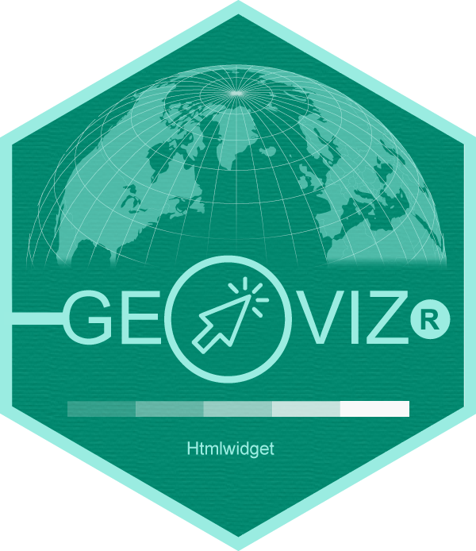
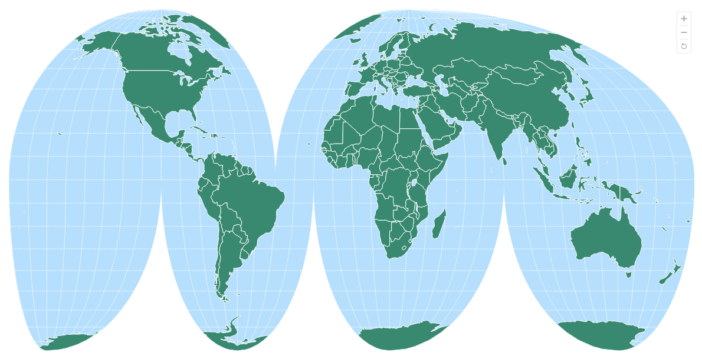
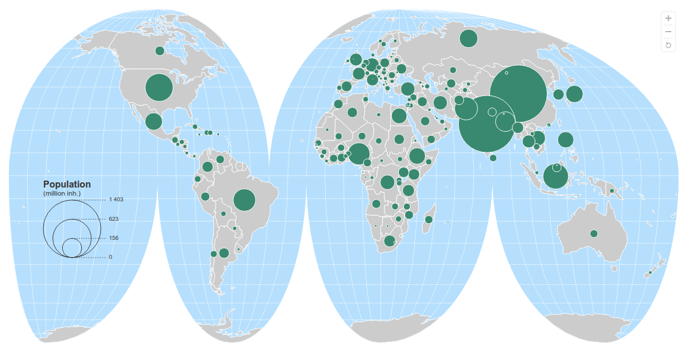
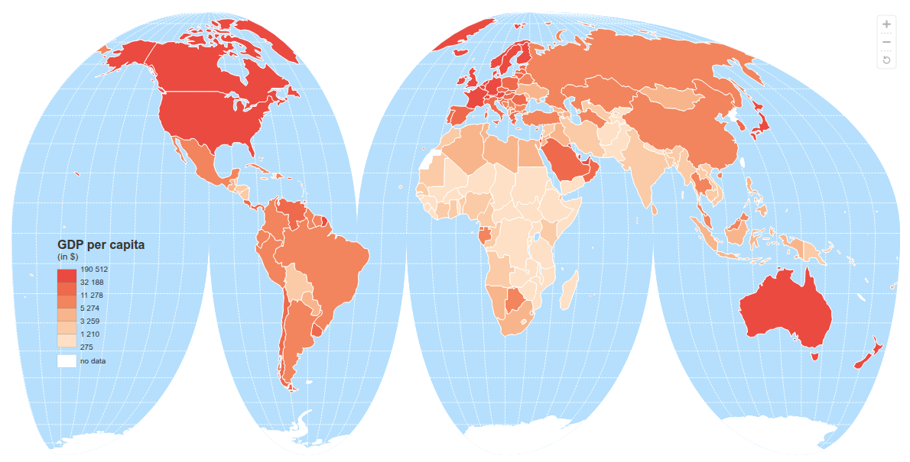

# geovizr 

[](https://riatelab.r-universe.dev/geovizr)
[](https://www.repostatus.org/#active)

**Interactive Cartography (htmlwidget)**

geovizr is an R package for thematic mapping. It's an R wrapper around the 
[geoviz JavaScript](https://github.com/riatelab/geoviz) library, itself based on the [d3.js](https://d3js.org/)
ecosystem. Like the original JavaScript library, the package can be used to create a wide range of interactive,
zoomable vector maps,  taking advantage of d3's many features: proportional symbols, pictograms, typologies,
choropleth maps, spikes,  tiles, Dorling cartograms, etc. 
It can also be used to create pretty static vectorial maps in SVG format, 
suitable for editorial cartography.

## Installation

You can install the released version of `geovizr` from
CRAN with:

``` r
install.packages("geovizr")
```

Alternatively, you can install the development version of `geovizr` from [r-universe](https://riatelab.r-universe.dev/geovizr)
with:

``` r
install.packages("geovizr", repos = c("https://riatelab.r-universe.dev", "https://cloud.r-project.org"))
```

## Usage

Creating a map with `geovizr` requires chaining several functions.
The `create()` function initializes a map with general parameters.
Then, functions such as `outline()`, `graticule()`, `path()`, and many others
allow you to add and refine layers. Finally, the `render()` function displays
the map. Here are a few examples.


First, let's load some data

```r
library(sf)
world <- st_read(
  system.file("gpkg/world.gpkg", package = "geovizr"),
  quiet = TRUE
)
```

- A simple map

```r
viz_create(projection = "InterruptedMollweide", zoomable = TRUE) |>
  viz_outline() |>
  viz_graticule(stroke = "white") |>
  viz_path(data = world, fill = "#38896F", tip = "$NAMEen") |>
  viz_render()
```



- Proportional symbol

```r
viz_create(projection = "InterruptedMollweide", zoomable = TRUE) |>
  viz_outline() |>
  viz_graticule(stroke = "white") |>
  viz_path(data = world, fill = "#CCC") |>
  viz_prop(data = world, var = "pop", fill = "#38896F",
           leg_pos = c(60, 300),  
           leg_values_factor = 1/1000000,
           leg_values_round = 0,
           leg_title  = "Population",
           leg_subtitle = "(million inh.)"
           ) |>
  viz_render()
```



- Choropleth

```r
viz_create(projection = "InterruptedMollweide", zoomable = TRUE) |>
  viz_outline() |>
  viz_graticule(stroke = "white") |>
  viz_path(data = world, fill = "#CCC") |>
  viz_choro(data = world, var = "gdppc",
            colors = "Peach",
            leg_title  = "GDP per capita",
            leg_subtitle = "(in $)",
            leg_values_round = 0,
            leg_pos = c(60, 300)
            ) |>
  viz_render()
```



## Alternatives

`geovizr` is not intended to compete with other mapping packages in R, such as [mapsf](https://CRAN.R-project.org/package=mapsf) or [tmap](https://CRAN.R-project.org/package=tmap).
It really focuses on the html / interactive geovisualisation.  

## Community Guidelines

One can contribute to the package through [pull
requests](https://github.com/riatelab/geovizr/pulls) and report issues or
ask questions [here](https://github.com/riatelab/geovizr/issues).


