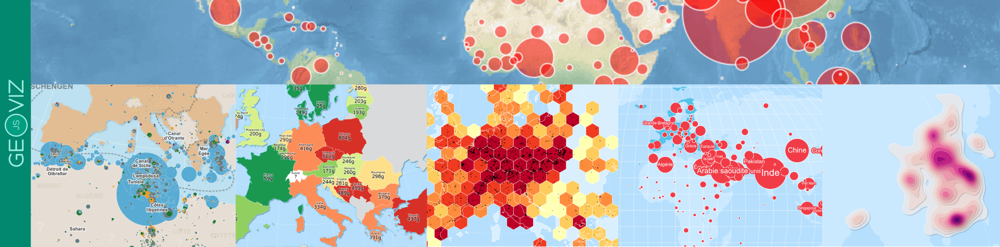

# Hello geovizr



**The `geovizr` package is a (partial) R interface to the
[geoviz](https://github.com/riatelab/geoviz) JavaScript library. It
allows users to create vector-based, interactive, and zoomable thematic
maps.**

- The `geovizr` package is an R wrapper around the geoviz JavaScript
  library via a htmlwidget. Its development follows the evolution of the
  library. The parameter names are the same. You can therefore refer to
  the JavaScript `geoviz` documentation
  [here](https://riatelab.github.io/geoviz/).
- Since it’s based on `d3.js`, the philosophy behind this package is
  completely different as other R mapping packages. Map parameters use
  svg attributes rather than the usual R parameters. Thus, `strokeWidth`
  is used rather than `lwd`, `fill` rather than `col`, `stroke` rather
  than `border`, etc.
- `geovizr` is not designed to handle voluminous datasets. It is
  suitable for light, generalized basemaps.
- `geovizr` is designed to work with geographic data in wgs84 (not
  projected). Geometries are then projected on the fly using the
  `create()` function. Unlike other R packages based on `sf`, the
  projections used come from the `d3.js` ecosystem (`d3-geo`,
  `d3-geo-projection` & `d3-geo-polygon`).
- Maps generated by `geovizr` are zoomable. Two types of zoom are
  available. The classic type (pan and zoom) and the “versor” type for
  creating interactive globes.
- Maps created with `geovizr` are interactive. It is therefore possible
  to create tooltips to access information contained in geographic
  objects.
- Many different types of maps are available. The types can be combined
  with each other and are highly customizable.

Here an example of a map designed with the package:

## Installation

You can install the released version of `geovizr` from CRAN with:

``` r
install.packages("geovizr")
```

Alternatively, you can install the development version of `geovizr` from
[r-universe](https://riatelab.r-universe.dev/geovizr) with:

``` r
install.packages("geovizr", repos = c("https://riatelab.r-universe.dev", "https://cloud.r-project.org"))
```

then

``` r
library(geovizr)
```

## Syntax

There are several steps involved in creating a map with `geovizr`.

**1** - First, create the map container using the **`create()`**
function. This is where you define the projection, margins, background
color, etc. - in short, all the general parameters of the map.

**2** The next step is to progressively add layers. A set of dedicated
functions is available for this purpose. For instance,
[`viz_path()`](https://riatelab.github.io/geovizr/reference/viz_path.md)
adds a spatial dataframe,
[`viz_graticule()`](https://riatelab.github.io/geovizr/reference/viz_graticule.md)
draws latitude and longitude lines,
[`viz_header()`](https://riatelab.github.io/geovizr/reference/viz_header.md)
inserts a title, and
[`viz_footer()`](https://riatelab.github.io/geovizr/reference/viz_footer.md)
adds a source note. All available functions are documented in the
Reference section.

**3** - Then, the **`render()`** function displays the map

The various functions can be chained together with a pipe (**`|>`**).

Now, let’s build a world map.

``` r
# Data Loading
library(sf)

world <- st_read(
  system.file("gpkg/world.gpkg", package = "geovizr"),
  quiet = TRUE
)

cities <- st_read(
  system.file("gpkg/cities.gpkg", package = "geovizr"),
  quiet = TRUE
)
```

*⚠️ The geometries must be in latitude and longitude coordinates, not
projected. Use WGS84.*

``` r
viz_create() |>
  viz_outline() |>
  viz_graticule() |>
  viz_path(data = world) |>
  viz_path(data = cities) |>
  viz_header(text = "Hello World") |>
  viz_render()
```

## Styling

As you can see, the name of the parameters don’t look like classical R
parameters. Since it’s based on d3.js, map parameters use svg attributes
rather than the usual R parameters. Thus, `strokeWidth` is used rather
than `lwd`, `fill` rather than `col`, `stroke` rather than `border`,
etc.

All layers have default parameters, but you can modify them. Here is a
list of parameters you can use on most layers:

- `fill`: Sets the fill color of the element. Can be a fixed color
  (e.g., “steelblue”) or a function mapping a data variable to colors.
- `stroke`: Sets the color of the element’s outline (border). Example:
  “#000” for black.
- `strokeWidth`: Width of the outline in pixels. Controls how thick the
  border appears.
- `opacity`: Overall opacity of the element, from 0 (fully transparent)
  to 1 (fully opaque).
- `fillOpacity`: Opacity of the fill only, separate from the stroke.
- `strokeOpacity`: Opacity of the stroke only.
- `strokeDasharray`: Defines a dash pattern for the stroke. Example:
  “5,5” creates dashed lines of 5px segments with 5px gaps.
- `strokeLinecap`: Defines the shape of the ends of lines. Values:
  “butt”, “round”, “square”.
- `strokeLinejoin`: Defines the shape of joints between connected lines.
  Values: “miter”, “round”, “bevel”.

*⚠️ Be careful: pay attention to uppercase and lowercase letters.*

Let’s take the previous map and customize it to our liking.

``` r
viz_create() |>
  viz_outline(fill = "#38896F", fillOpacity = 0.3) |>
  viz_graticule(stroke = "white", step = 20) |>
  viz_path(
    data = world, fill = "white",
    stroke = "none", fillOpacity = 0.3
  ) |>
  viz_path(
    data = cities, pointRadius = 2,
    stroke = "none", fill = "#38896F"
  ) |>
  viz_header(
    text = "Hello World", fill = "white",
    background_fill = "#38896F"
  ) |>
  viz_render()
```

## Positioning of elements

To position symbols or text on the map, we most often use the
coordinates from a spatial dataframe. However, it is also possible to
place specific elements at precise coordinates. For this, two coordinate
systems coexist in `geovizr`:

- **Geographical coordinates**

By specifying `coords = "geo"`, you can position an element at precise
geographic coordinates. The object is then linked to the map and stays
in the correct location according to the zoom level.

``` r
# A simple map
mumbai <- c(72.88, 19.07)
viz_create(zoomable = T) |>
  viz_path(data = world, fill = "#CCC", stroke = "none", fillOpacity = 0.3) |>
  viz_circle(pos = mumbai, coords = "geo", fill = "#38896F", r = 10) |>
  viz_render()
```

- **SVG coordinates**

By specifying `coords = "svg"`, you can also position an element
statically directly on the map plane. This is very useful for decorative
elements, such as the legend or text labels.

**⚠️ *The origin of the coordinate system used to express coordinates in
an SVG document is located at the top left.***

``` r
# A simple map
viz_create(zoomable = T) |>
  viz_path(data = world, fill = "#CCC", stroke = "none", fillOpacity = 0.3) |>
  viz_circle(pos = c(300, 100), coords = "svg", fill = "#38896F", r = 10) |>
  viz_render()
```

## Symbology

Specialized functions are available for representing statistical data,
whether qualitative or quantitative. For example:

- [`viz_choro()`](https://riatelab.github.io/geovizr/reference/viz_choro.md):
  for relative quantitative data
- [`viz_prop()`](https://riatelab.github.io/geovizr/reference/viz_prop.md):
  for absolute quantitative data
- [`viz_typo()`](https://riatelab.github.io/geovizr/reference/viz_typo.md):
  for qualitative data

These functions take two main parameters: `data` for the base map and
`var` for the variable to be mapped. Additional parameters allow for
fine customization of both the map and its legend.

Here is a simple example of a proportional symbol map

``` r
viz_create() |>
  viz_path(datum = world, fill = "#CCC") |>
  viz_prop(data = world, var = "pop", fill = "#38896F") |>
  viz_render()
```

A choropleth map

``` r
viz_create() |>
  viz_choro(data = world, var = "gdppc", fill = "#38896F") |>
  viz_render()
```

And a typology

``` r
viz_create() |>
  viz_typo(data = world, var = "region") |>
  viz_render()
```

For more details, see the “symbology” page.
