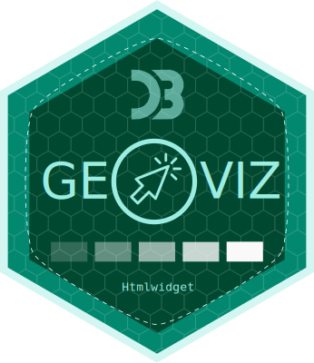

### geoviz is an R package for thematic mapping. As its name suggests, it’s an R wrapper around the [geoviz JavaScript library](https://github.com/riatelab/geoviz), itself based on the [d3.js](https://d3js.org/) ecosystem ported by Mike Bostock. Like the original javascript library, the package can be used to create a wide range of interactive, zoomable vector maps, taking advantage of d3’s many features: proportional symbols, pictograms, typologies, choropleth maps, spikes, tiles, Dorling cartograms, etc. It can also be used to create pretty static vectorial maps in SVG format, suitable for editorial cartography.

  

- The `geoviz` package is an R wrapper around the geoviz JavaScript
  library via a htmlwidget. Its development follows the evolution of the
  library. The parameter names are the same. You can therefore refer to
  the JavaScript geoviz documentation
  [here](https://riatelab.github.io/geoviz/).

- `geoviz` is not intended to compete with other mapping packages in R,
  such as
  [mapsf](https://cran.r-project.org/web/packages/mapsf/index.html) or
  [tmap](https://cran.r-project.org/web/packages/tmap/index.html).

- Since it’s based on d3.js, the philosophy behind this package is
  completely different as other R mapping packages. Map parameters use
  svg attributes rather than the usual R parameters. Thus, `strokeWidth`
  is used rather than `lwd`, `fill` rather than `col`, `stroke` rather
  than `border`, etc.

- `geoviz` is not designed to handle voluminous datasets. It is suitable
  for light, generalized basemaps.

- `geoviz` is designed to work with geographic data in wgs84 (not
  projected). Geometries are then projected on the fly using the
  `create()` function. Unlike other R packages based on `sf`, the
  projections used come from the d3.js ecosystem (d3-geo,
  d3-geo-projection & d3-geo-polygon).

- Maps generated by `geoviz` are zoomable. Two types of zoom are
  available. The classic type (pan and zoom) and the “versor” type for
  creating interactive globes.

- Maps created with `geoviz` are interactive. It is therefore possible
  to create tooltips to access information contained in geographic
  objects.

- Many different types of maps are available. The types can be combined
  with each other and are highly customizable.
